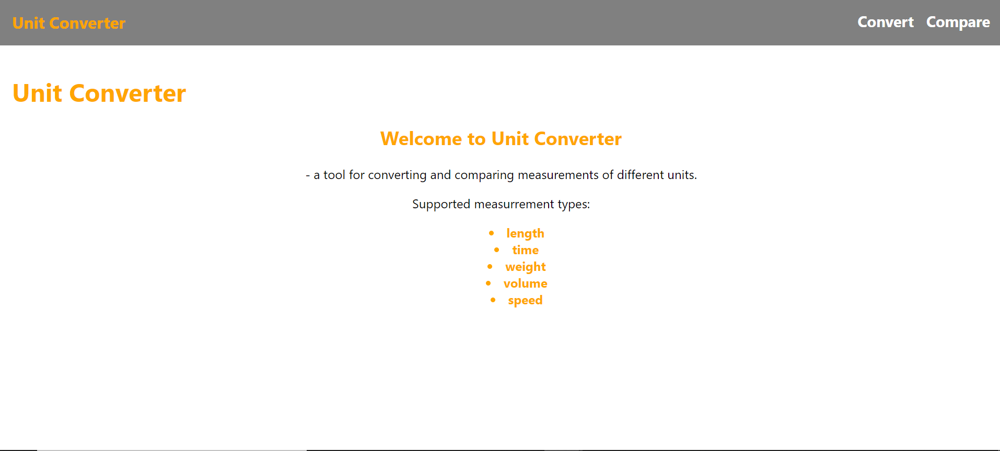
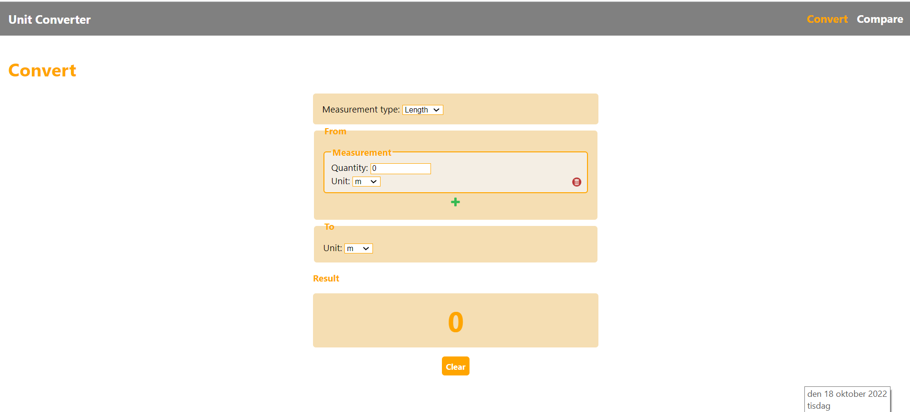
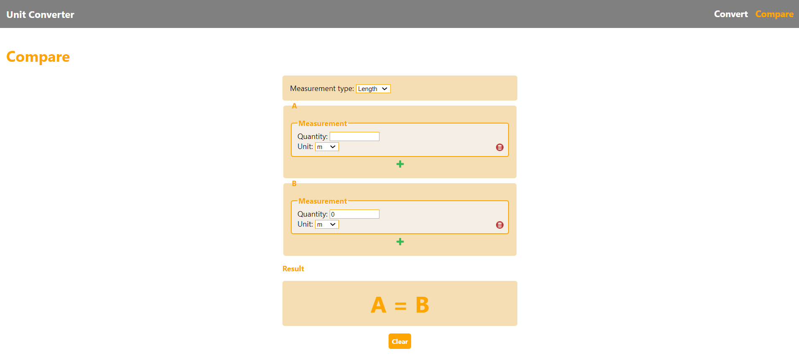

# Unit Converter - The Client App
Unit Converter is a SPA web application written in vanilla JavaScript using custom web components that lets the end-user convert and compare measurements of the type length, time, weight and volume. It is developed with the support of Vite, a tool that sets up a developement server and offers build functionality. It also depends on the module [converter](https://github.com/EllinorHenriksson/converter).

## Installation
- Download the application to your local machine
- Run ``npm i`` to install all npm dependencies
- Manually download the [converter](https://github.com/EllinorHenriksson/converter) module from its GitHub repo and place it in a folder called ``modules`` in the root folder of the project: ``/modules/< place module here >``
- The above step is VERY IMPORTANT as the application depends on the converter module and imports it from specific paths

## Serve the application during development
- Run ``npm run dev``
- This command sets up a developement server on the local machine wich hosts the application and updates it continously as you develop the code

## Deployment
- Run ``npm run build`` to create static files wich can be deployed on a production server.
- The application is already deployed on Netlify. Visit it [here](https://heartfelt-paletas-b77118.netlify.app).

## Using the app
If you whish to use the app as an end-user, you can find it [here](https://heartfelt-paletas-b77118.netlify.app).

### Convert
To convert measurements, click on the ``Convert`` link in the navbar. Select the measurement type you want to use. Add as many measurements as you like to be converted, specifying ``quantity`` and ``unit``, and select the unit to convert to. The conversion result is updated continously in the result box. Click on the ``Clear`` button to clear the converter from the measurements and the result.

### Compare
To compare measurements, click on the ``Compare`` link in the navbar. Select the measurement type you want to use. Add as many measurements as you like to be compared, specifying ``quantity`` and ``unit``, in each of the measurement groups (A and B). The comparment result is updated continously in the result box. Click on the ``Clear`` button to clear the comparer from the measurements and the result.

