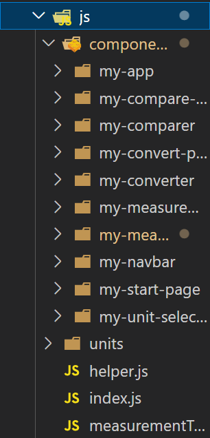

# Reflection

## Chapter 2: Meaningful Names
Metoderna är namngivna för att så tydligt som möjligt beskriva vad de gör, där tydlighet premieras före att hålla namnen korta. Parametrar i metoder är namngivna för att pass ihop med metodnamnet, så att de tillsammans skapar en god förståelse hos användaren vad gäller metodens syfte och användning. På så sätt har jag strävat efter att göra koden självdokumenterande, det vill säga det ska vara lätt att titta på metodsignaturen för att förstå vad metoden gör, utan att behöva läsa kommentarer. Lokala konstanter och variabler är namngivna för att tydligt illustrera vilka värden de representerar - alltså värdenas roll i koden - för att undvika s.k. mental mapping.

Bild: Beskrivande metodsignatur (unit-converter/src/js/components/my-measurement-list/my-measurement-list.js)

## Chapter 3: Functions
Alla funktioner och metoder är små - de flesta innehåller ca 3-5 rader kod. Det finns några få större funktioner som innehåller ca 10 rader kod. I dessa fall är det ofta if-else satser som måste testas. I andra fall när funktioner vuxit sig stora har jag sett till att bryta ut koden enligt principen att en funktion endast ska göra en sak. Jag har också sett till att hålla abstraktionsnivån homogen genom funktionerna.

Bild: Liten abstrakt metod (unit-converter/src/js/components/my-converter/my-converter.js)

## Chapter 4: Comments
Metodkommentarerna samverkar med metodsignaturerna för att tillsammans ge användaren förståelse för hur metoden ska användas och vad den gör. De är skrivna så korta som möjligt för att vara läsbara (annars finns risk att användaren möts av en vägg av text och struntar att läsa kommentaren). Parametrar och returvärden dokumenteras avseende typ och betydelse i sammanhanget. Eftersom koden är skriven i JavaScript är typer extra noga kommenterade i koden - både i metoder och i medlemsfält. Koden är skriven för att så långt som möjligt vara självdokumenterande. Detta innebär att metodkommentarer kan hållas korta och radkommentarer undvikas. Jag använder LNU:s eslint-verktyg i koden och följer därmed deras kodstandard. I denna ingår att kommentera alla klasser och metoder. Därmed skapas många kommentarer som av boken anses vara överflödiga, t.ex. kommentarer för enkla konstruktorer. Detta är dock ett medvetet val från min sida.

Bild: Överfödig kommentar (unit-converter/src/js/components/my-start-page/my-start-page.js)

## Chapter 5: Formatting
Klasserna upptar ett dokument var. För att de ska vara tillräckligt överskådliga är de inte längre än ca 200 rader. Publika metoder är placerade högst upp av metoderna i klassen, följt av privata metoder, enligt tidningsprincipen. Metoderna är även vertikalt utplacerade med hänsyn till i vilken sekvens de anropas. Koncept skiljs från varandra genom blankrader (t.ex. importer i en klass, eller funktioner i relation till varandra).

Bild: Vertikal formattering av metoderna i en klass (unit-converter/src/js/components/my-unit-selector/my-unit-selector.js)

## Chapter 6: Objects and Data Structures
Överlag är koden skriven ur ett så objektorienterat perspektiv som möjligt, även om den är skriven i JavaScript. Klasserna kapslar in så mycket information som möjligt genom att hålla fält och metoder privata och endast tilldela fälten "accessors" och "mutators" om det verkligen behövs. Jag måste erkänna att det är mer naturligt att skriva objektorienterat i Java, och att jag stött på vissa svårigheter när jag jobbat med klasser och objekt i JavaScript. Exemplevis implementerade jag abstraktion av en superklass - en funktionalitet som inte finns inbyggd i JavaScript - genom att kasta undantag i konstruktorn (se bild).

Bild: (src/measurements/singleMeasurement.js)

## Chapter 7: Error Handling
I min kod kastar jag undantag med särskilda, beskrivande felmeddelanden, framförallt i valideringsmtoderna. Jag skickar inte tillbaka felkoder. Jag har inte skapat egna klasser för untantagen då jag inte bedömt det nödvändigt för tydligheten. Undantagen som kastas är av de redan inbyggda typerna Error, TypeError och RangeError - i kombination med tydliga felmeddelanden ger de tillräcklig information till användaren. Undantagen kastas i samband med att användaren skickar in input i form av argument till metoderna, och kan därför fångas upp och hanteras i samband med dessa anrop. 

Bild: Exempel på felmeddelande (converter/src/validator.js)

## Chapter 8: Boundaries
Modulen används på så få ställen som möjligt i koden. Hade jag skrivit koden i Java hade jag kunnat implementera ett interface för modulen. Ett alternativ i JavaScript hade kanske kunnat vara att skapa en klass som utgör gränsen mellan applikationens kod och modulens kod, men detta är ovant för mig eftersom jag under utbildningen vant mig att använda t.ex. npm moduler lite varstans i koden. Jag tycker att det tillvägagångssättet har fungerat bra.

## Chapter 9: Unit Tests
I modulen testar jag koden med hjälp av automatiska enhetstester som jag skrivit i ramverket Jest. Testerna täcker väldigt stora delar av koden och gör det därför enkelt att förändra koden utan att riskera att buggar uppstår. Så länge en förändring har ett motsvarande test och alla tester går igenom är det sannolikt att hela koden fungerar. Testerna är korta och testar endast ett koncept var, vilket gör testerna lättlästa och lätthanterade. Testerna är också oberoende av varandra, vilket är en av FIRST-reglerna.

Bild: (converter/test/length.test.js)

## Chapter 10: Classes
Klasserna är skrivna i en vertikal ordning där fälten deklareras högst upp, följt av publika metoder vilka följs av privata metoder som den publika metoden anropar, enligt tidningsprincipen. Fälten, liksom metoder som endast används av klassen själv, är privata för att främja inkapsling. Klasserna är aldrig större än ca 200 rader kod, både för att de ska vara översiktliga men också för att de inte ska få för många ansvarsområden. Jag tycker det kan vara svårt som relativ nybörjare inom objektorienterad mjukvarudesign att designa klasser som håller sig till SRP (single responsibility principle), men jag tycker att jag har gjort ett gott försök till att bryta ut koden i så många lämpliga klasser som möjligt. I applikationen representeras klasserna av webbkomponenter. 

## Chapter 11: Systems
Arkitekturen i applikationen är gjord enligt ett rekommenderat upplägg där webbkomponenter läggs i separata mappar i en gemensam övermapp. En huvudkomponent - i detta fall my-app - importeras av en javascript-fil som i sig importeras i det huvudsakliga html-dokumentet för webbapplikationen. Övriga webbkomponenter importeras av andra webbkomponenter som använder sig av dem i sina egna DOM-strukturer. Genom att följa denna struktur blir det enkelt att fortsätta jobba med applikationen och lägga till nya webbkomponenter/funktionalitet. Jag har även förökt dela upp modulen i mappar som representerar olika delar av systemet/grupper av klasser.

Bild: JavaScrip-katalogen i applikationen innehållande bl.a. webbkomponenter (unit-converter/src/js/)
